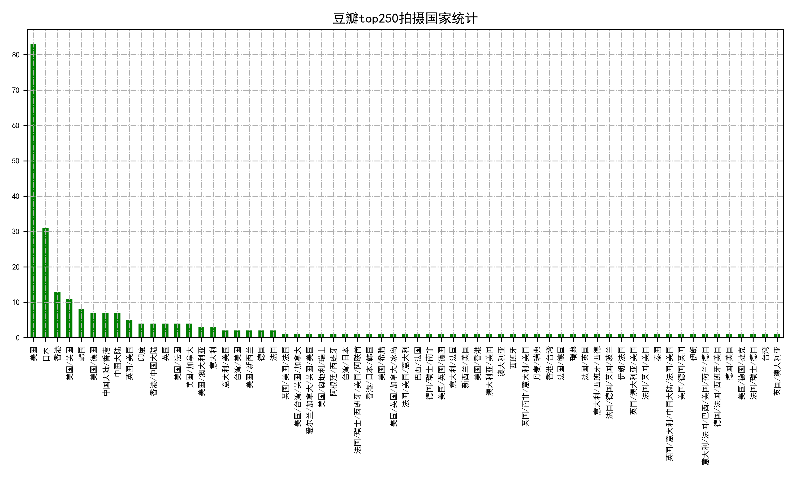

# Data analysis and visualization by Douban（not completed ）

## Requirements

* requests->2.21.0  
* beautifulsoup4->4.7.1  
* re  
* os  
* tqdm->4.31.1  
* matplotlib->3.0.3  
* numpy->1.16.3  
* pandas->0.42.2  
* configparser->3.7.3  
* pickle  

## Program

* Ip in random(not completed)
* Data crawling by spider
* Data analysis and visualization

## Data crawling by spider(spider.py)

Func|Purpose
---|---
crawl_url(url, params=None)|Requests and parse url by requests.
parse_html(html)|Parse and get the url in detail by beautifulsoup.
parse_details(html)|Parse and detail page and return the data,such as name,star,director,etc.
require_data(urls, count, page)|Transmit the url and return the data by urls,count,page.

## Data analysis and visualization(analysis_data.py)

function|Purpose
---|---
plot_nation(data)|Draw the bar chart of all the country in DoubanTop250 by data(pandas.DataFrame).
average_star(data)|Draw the bar chart of marks in DoubanTop250 by data(pandas.DataFrame.
plot_nation_person(data)|Draw the bar chart and pie chart of all the country in person in DoubanTop250 by data(pandas.DataFrame).
group_type(data, path)|draw the chart of type of movie.
release_language(data, path)|fraw the chart of language by moive
format_date(data)|Fransmit and change the data(dict) to data(DataFrame) and drawl the chart by transfering other function.

### Run（run.py）

function|Purpose
---|---
read_config(section, key)| Fead the configure(config) read the group by section，read the key
save_local(data, path)|Save the pickle.pk to local path.data is the incoming data.
run()|main funcion that connecting other functions.

## Illustration

**There are many logical error in functions and in the connection part, and unexpected part in the Internal implementation.**