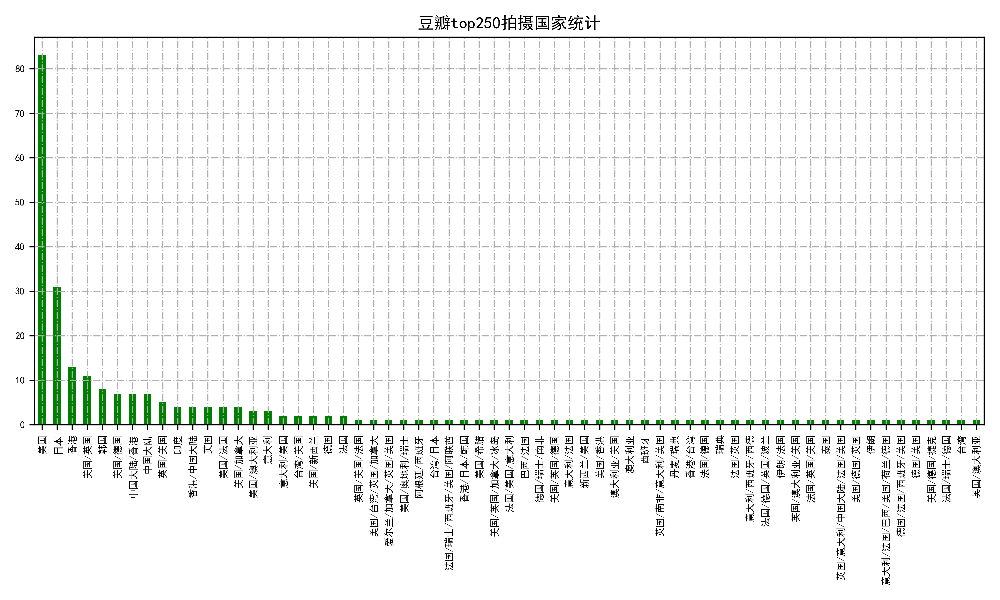

# 豆瓣数据分析项目（未完成）

## 依赖库

* requests->2.21.0  
* beautifulsoup4->4.7.1  
* re  
* os  
* tqdm->4.31.1  
* matplotlib->3.0.3  
* numpy->1.16.3  
* pandas->0.42.2  
* configparser->3.7.3  
* pickle  

## 项目

* 随机部ip部分（还没完成）
* 数据抓取（爬虫）部分
* 数据分析阶段

## 爬虫部分(spider.py)

函数|功能
---|---
crawl_url(url, params=None)|利用requests库解析url
parse_html(html)|解析豆瓣top250榜单html，获取影片的详情页面
parse_details(html)|解析豆瓣电影详情页面html内容
require_data(urls, count, page)|通过传入的url，count为电影数目，page为页面数目

## 数据分析部分(analysis_data.py)

函数|功能
---|---
plot_nation(data)|通过传入的data(pandas.DataFrame)绘制豆瓣top250所有拍摄国家的柱状图
average_star(data)|通过传入的data(pandas.DataFrame)绘制豆瓣top250榜单电影的评分柱状图
plot_nation_person(data)|通过传入的data(pandas>DataFrame)绘制所有拍摄国家的扇形图和评分柱状图（将联合拍摄的国家拆分）
group_type(data, path)|绘制所有国家拍摄类型统计图
release_language(data, path)|绘制拍摄所用语言统计图
format_date(data)|将传入的data（dict）转化为data(DataFrame)并调用其他函数进行数据分析和可视化图形绘制

### 运行部分（run.py）

函数|功能
---|---
read_config(section, key)| 读入config（配置） section读入配置组，key读入配置
save_local(data, path)|保存pickle到本地，data为传入数据，path为传入路径
run()|设置为主函数，负责连接其他函数

## 图例

**有很多程序逻辑没有理清，函数的连接处很混乱，函数内部实现有许多赘余**
