# 去哪儿网景点信息分析

# 景点价格

选取MySQL数据库每个省份价格不为0的景点进行描述性统计，计算起平均值。
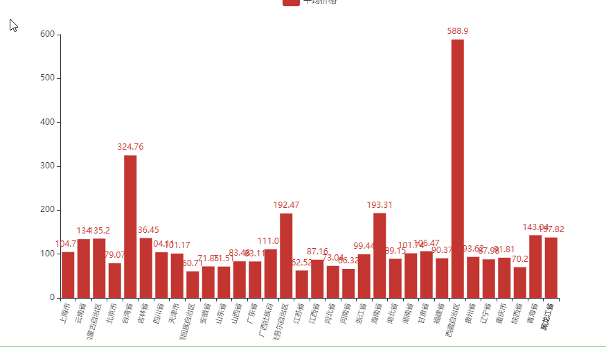

从结果上看，各个省份价格基本一致，西藏算是一枝独秀了。

但这种效果可能因为数据本身的原因。所以，再次进行分析，选取每个省50个数据，分为三组进行
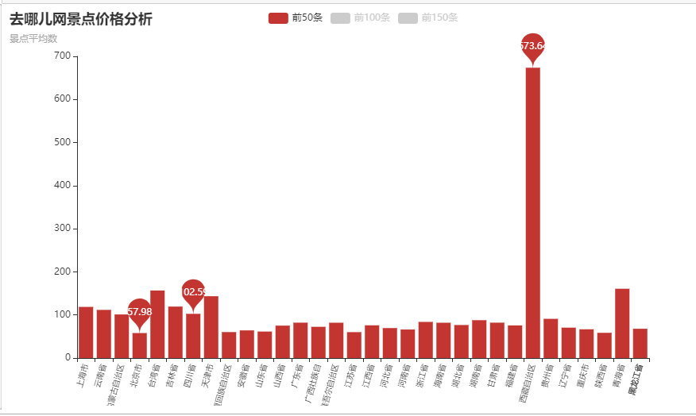
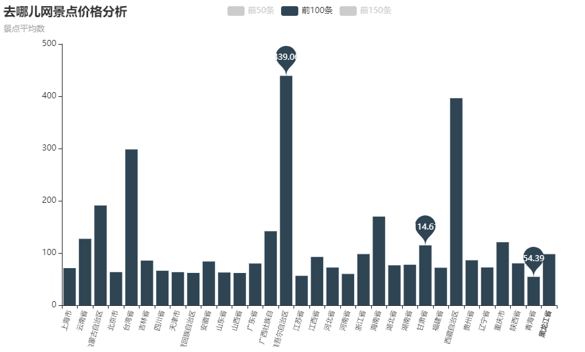
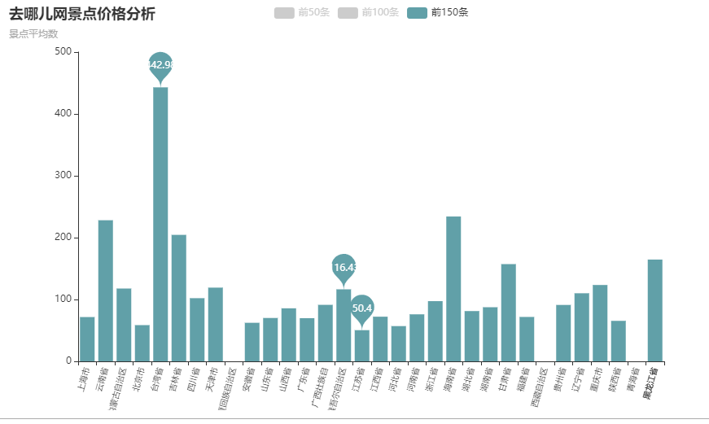
比较三组数据。不难发现，西藏景点是真的贵，台湾也不怎么便宜。
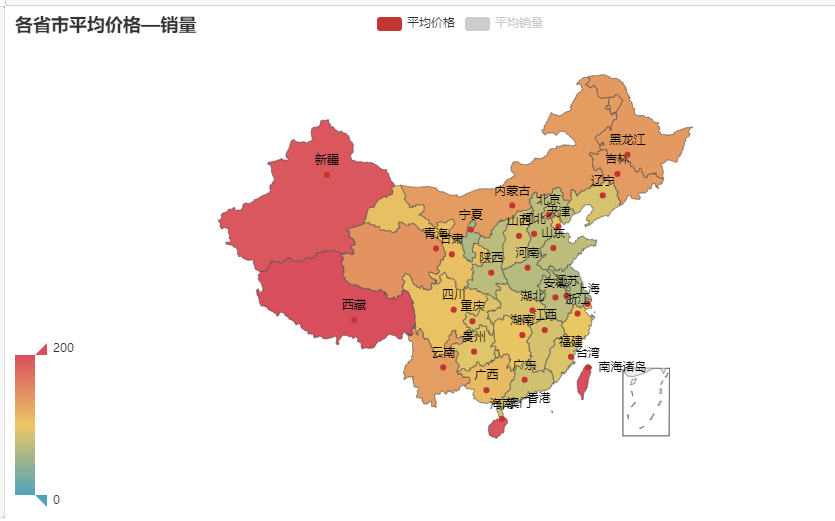
从全国地区分布上来看，新疆、西藏、海南和台湾地区要比其他地区单价高很多。
另外，查看详图，反而北上广却平均单价却没那么贵。
再从箱型图角度进行比较，可能会有意外的收获。

## 箱型图

箱型图采用的是每个省份价格降序排列前50条数据
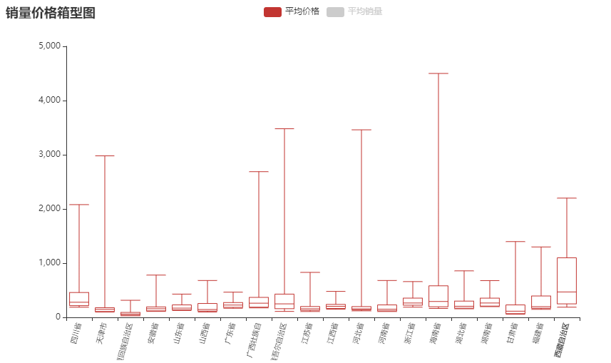
价格最低
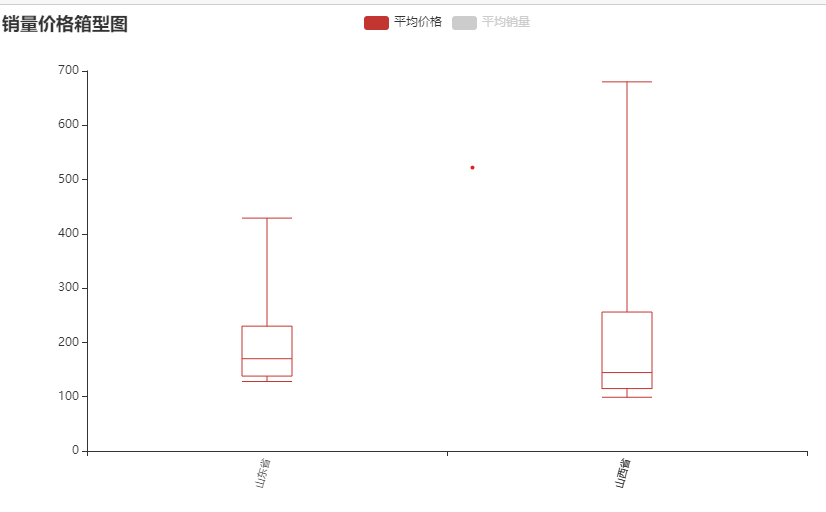
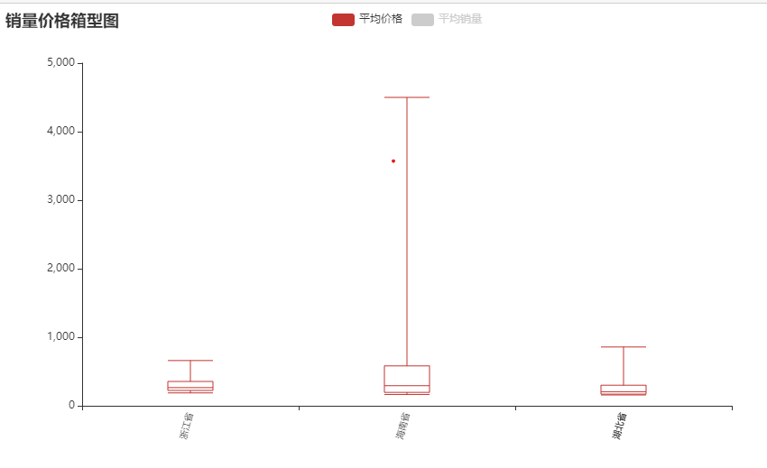
从数据中得出，价格较高和价格较低的省份相差十分较大，原本以为发达省份与旅游省份价格是正相关的，现在观念可能要变一变了。

## 景点销量

从销量来看，会不会有不一样的情况呢
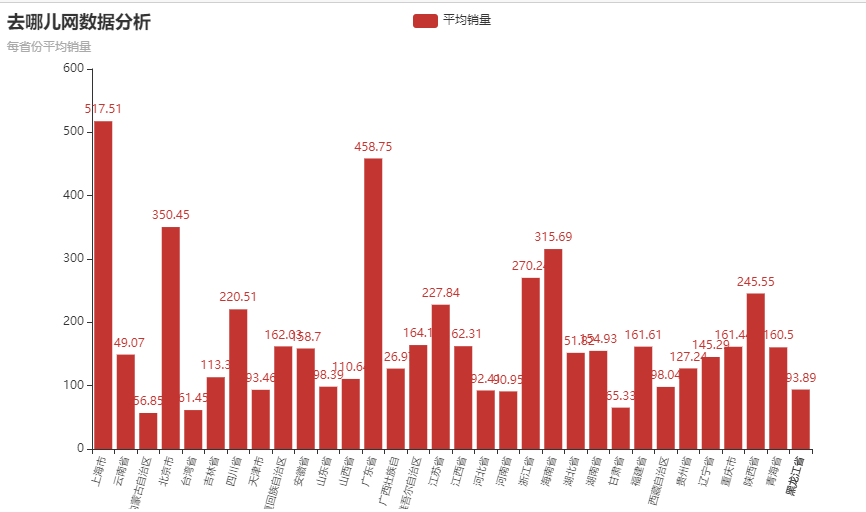
按照分析价格的套路走一遍销量，情况会怎样呢
这里同样选取150条销量进行分析
**前50条**
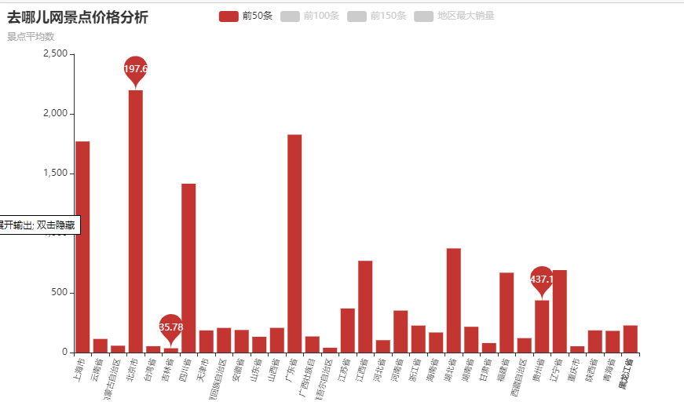
**中间50条**
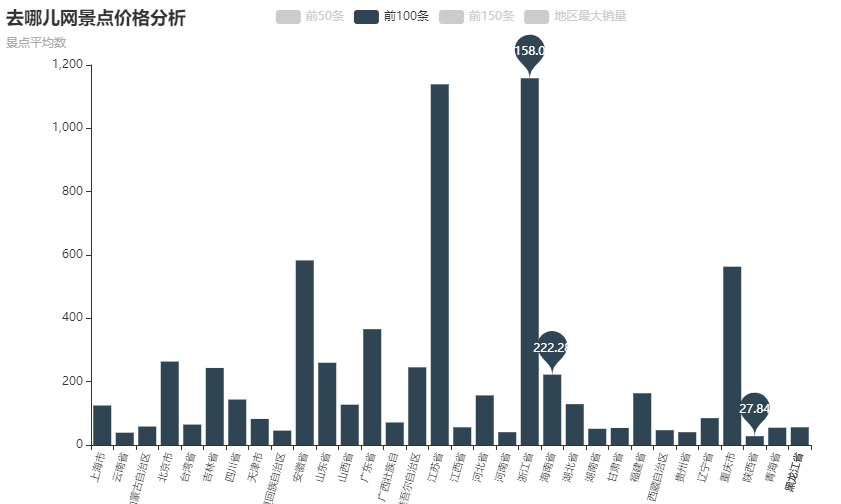
**后50条**
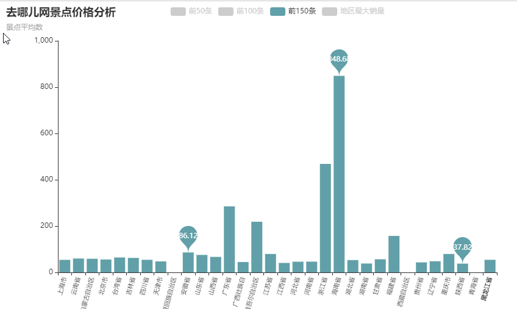

从数据中看出北京、浙江和海南分别在前50条，中间50条，后50条的时候占据优势，但最后大赢家却是上海，有点奇怪了。
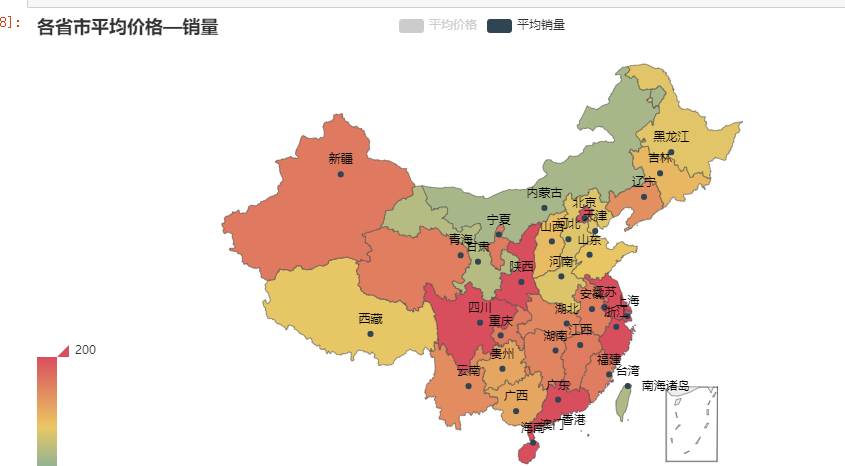
再来对比箱型图
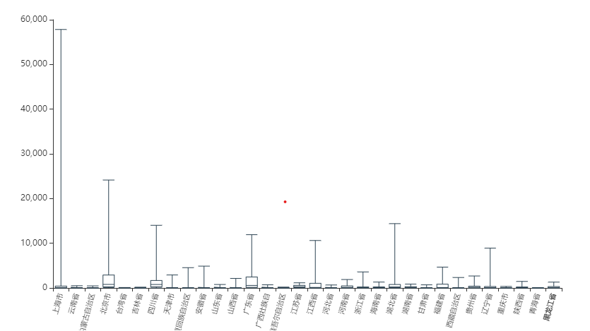
近距离观赏一下
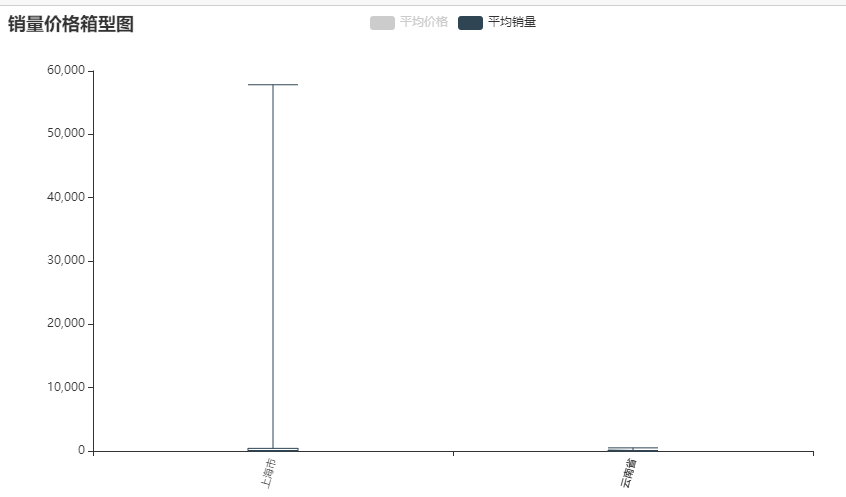
可怕，不知道哪个神仙地销量如此爆棚。
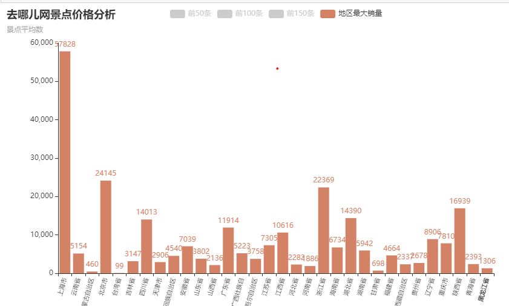
从数据库中查找一下这个神仙吧
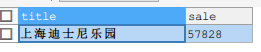
从页面中查看
2019年10月1号爬取的信息，今天3号，销量增长这么多，真是个迷人（吸金）的地方
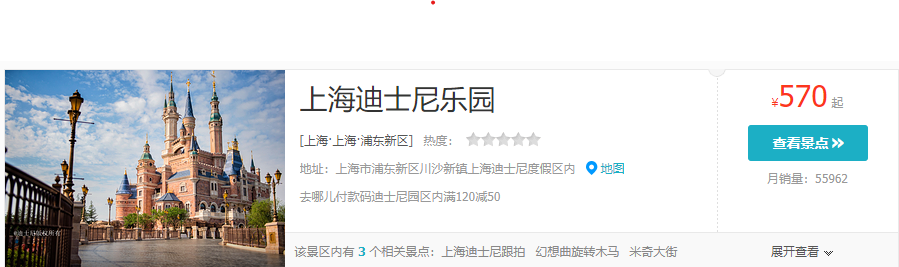
链接如下
[链接](http://piao.qunar.com/ticket/detail_1174758904.html?st=a3clM0QlRTQlQjglOEElRTYlQjUlQjclRTglQkYlQUElRTUlQTMlQUIlRTUlQjAlQkMlMjZpZCUzRDQ1NzQ3MiUyNnR5cGUlM0QwJTI2aWR4JTNEMSUyNnF0JTNEbmFtZSUyNmFwayUzRDIlMjZzYyUzRFdXVyUyNmFidHJhY2UlM0Rid2QlNDAlRTYlOUMlQUMlRTUlOUMlQjAlMjZ1ciUzRCVFNSVCRSVCNyVFNSVCNyU5RSUyNmxyJTNEJUU1JUJFJUI3JUU1JUI3JTlFJTI2ZnQlM0QlN0IlN0Q%3D#from=mpl_search_suggest)

## 销量价格对比
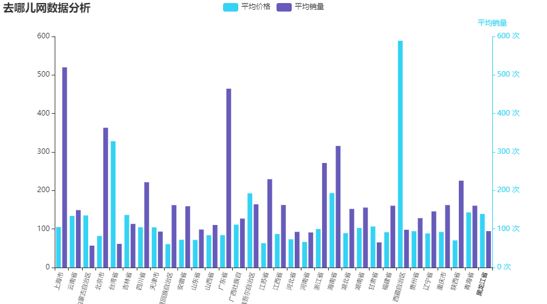
可以发现销量和数据没有明确的正相关关系（虽然也没有正经计算）
## 各个省市景点个数
省市太多，放不开
为什么没放全国的呢，因为之前抓取数据以省份为关键词抓取的。所以，放全国的没啥意义。

## 词云
最后就是各省市词云了，一个好玩有趣的东西
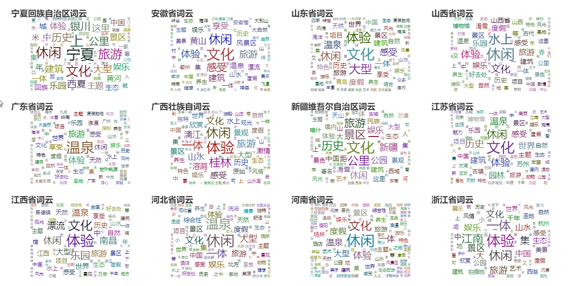
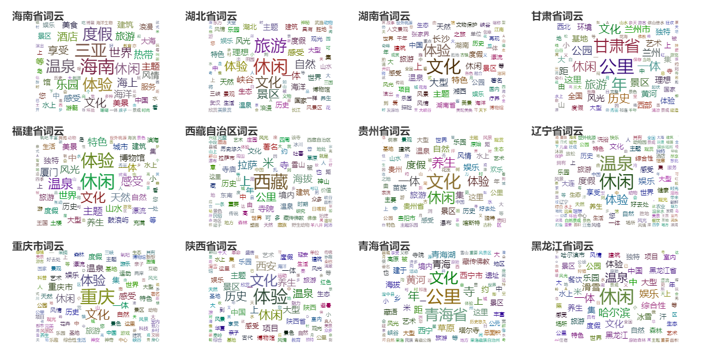

[notebook](https://nbviewer.jupyter.org/github/sunxiaolong321/Qunar/blob/master/qunar.ipynb)